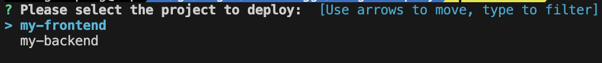

[English](README.md) | [中文](README_zh-CN.md)
# Single Deploy

A lightweight CLI tool for managing and deploying multiple projects simultaneously. It provides a simple way to handle deployment workflows for different types of applications.

## Features

- 🚀 Deploy multiple projects with a single command
- 📦 Support for different project types (Node.js, React, etc.)
- 🔄 Git integration for source code management
- 🏗️ Custom build and start commands
- 🏥 Health check monitoring
- 💻 Cross-platform support (Windows, Linux, macOS)

## Installation

### From Source

```bash
git clone https://github.com/shennonggo/single-deploy.git
cd single-deploy
make build-all
```

## Configuration Options

| Field | Description |
|-------|-------------|
| name | Project name identifier |
| path | Local path where the project will be deployed |
| type | Project type (nodejs, react, etc.) |
| gitRepo | Git repository URL |
| gitBranch | Git branch to deploy |
| buildCmd | Command to build the project |
| startCmd | Command to start the project |
| healthCheck.url | URL to check if service is healthy |
| healthCheck.timeout | Timeout in seconds for health check |

### Configuration File

配置文件应放置在 `configs/deploy-config.json`。以下是一个示例配置：

```json
{
  "projects": [
    {
      "name": "my-frontend",
      "path": "./projects/frontend",
      "type": "react",
      "gitRepo": "https://github.com/username/frontend-app.git",
      "gitBranch": "main",
      "buildCmd": "npm install && npm run build",
      "startCmd": "npm start",
      "healthCheck": {
        "url": "http://localhost:3000",
        "timeout": 30
      }
    },
    {
      "name": "my-backend",
      "path": "./projects/backend",
      "type": "golang",
      "gitRepo": "https://github.com/username/backend-service.git",
      "gitBranch": "main",
      "buildCmd": "go mod download && go build -o app",
      "startCmd": "./app",
      "healthCheck": {
        "url": "http://localhost:8080/health",
        "timeout": 60
      }
    }
  ]
}
```

## Building

The project includes a Makefile with the following targets:

```bash
make build-all      # Build for all platforms
make build-linux    # Build for Linux
make build-windows  # Build for Windows
make build-darwin   # Build for macOS
make clean         # Clean build artifacts
```

## Usage

```bash
./build/single-deploy/single-deploy-linux-amd64
```



## Requirements

- Go 1.21.6 or higher
- Git

## License

[MIT License](LICENSE)

## Contributing

Contributions are welcome! Please feel free to submit a Pull Request.
