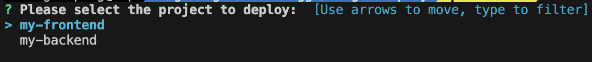

[English](README.md) | [中文](README_zh-CN.md)

# Single Deploy

一个轻量级的 CLI 工具，用于同时管理和部署多个项目。它为不同类型的应用程序提供了简单的部署工作流程管理方式。

## 特性

- 🚀 使用单个命令部署多个项目
- 📦 支持不同项目类型（Node.js、React 等）
- 🔄 集成 Git 进行源代码管理
- 🏗️ 自定义构建和启动命令
- 🏥 健康检查监控
- 💻 跨平台支持（Windows、Linux、macOS）

## 安装

### 从源码安装

```bash
git clone https://github.com/shennonggo/single-deploy.git
cd single-deploy
make build-all
```

## 配置选项

| 字段 | 描述 |
|-------|-------------|
| name | 项目名称标识符 |
| path | 项目部署的本地路径 |
| type | 项目类型（nodejs、react 等） |
| gitRepo | Git 仓库 URL |
| gitBranch | 要部署的 Git 分支 |
| buildCmd | 构建项目的命令 |
| startCmd | 启动项目的命令 |
| healthCheck.url | 服务健康检查的 URL |
| healthCheck.timeout | 健康检查超时时间（秒） |

### 配置文件

配置文件应放置在 `configs/deploy-config.json`。以下是一个示例配置：

```json
{
  "projects": [
    {
      "name": "my-frontend",
      "path": "./projects/frontend",
      "type": "react",
      "gitRepo": "https://github.com/username/frontend-app.git",
      "gitBranch": "main",
      "buildCmd": "npm install && npm run build",
      "startCmd": "npm start",
      "healthCheck": {
        "url": "http://localhost:3000",
        "timeout": 30
      }
    },
    {
      "name": "my-backend",
      "path": "./projects/backend",
      "type": "golang",
      "gitRepo": "https://github.com/username/backend-service.git",
      "gitBranch": "main",
      "buildCmd": "go mod download && go build -o app",
      "startCmd": "./app",
      "healthCheck": {
        "url": "http://localhost:8080/health",
        "timeout": 60
      }
    }
  ]
}
```

## 构建

项目包含以下 Makefile 目标：

```bash
make build-all      # 构建所有平台版本
make build-linux    # 构建 Linux 版本
make build-windows  # 构建 Windows 版本
make build-darwin   # 构建 macOS 版本
make clean         # 清理构建产物
```

## 使用方法

```bash
./build/single-deploy/single-deploy-linux-amd64
```



## 系统要求

- Go 1.21.6 或更高版本
- Git

## 许可证

[MIT 许可证](LICENSE)

## 贡献

欢迎贡献！请随时提交 Pull Request。